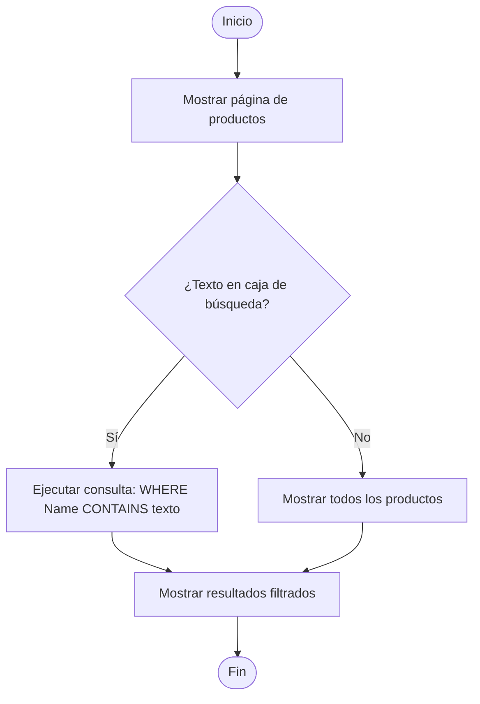

# Diagramas de flujo


## 1) Diagrama de flujo — BÚSQUEDA DE PRODUCTOS



---

## 2) Diagrama de flujo — EDICIÓN DE PRODUCTO (Actualizar Precio y Stock)

```mermaid
flowchart TD
  Start([Inicio]) --> List[Usuario en listado de productos]
  List --> ClickEdit[Usuario hace clic en "Editar"]
  ClickEdit --> Load{¿ID válido?}
  Load -- No --> NotFound[Mostrar error: producto no encontrado]
  NotFound --> End([Fin])
  Load -- Sí --> LoadForm[Cargar formulario con datos del producto]
  LoadForm --> Modify[Usuario modifica Precio/Stock]
  Modify --> Submit[Usuario envía formulario]
  Submit --> Validate{¿Datos válidos?}
  Validate -- No --> ShowErrors[Mostrar errores y volver al formulario]
  ShowErrors --> Modify
  Validate -- Sí --> Save[Actualizar entidad en DB y SaveChanges]
  Save --> Success[Mostrar mensaje de éxito]
  Success --> Redirect[Redirigir a Index]
  Redirect --> End([Fin])
```

---

## 3) Diagrama de flujo — ELIMINACIÓN DE PRODUCTO

```mermaid
flowchart TD
  Start([Inicio]) --> List[Usuario en listado de productos]
  List --> ClickDelete[Usuario hace clic en "Eliminar"]
  ClickDelete --> ConfirmPage[Mostrar página de confirmación]
  ConfirmPage --> UserChoice{Usuario confirma eliminación?}
  UserChoice -- No --> Cancel[Cancelar y volver al listado]
  Cancel --> End([Fin])
  UserChoice -- Sí --> Find{¿Encontró producto por ID?}
  Find -- No --> NotFound[Mostrar error: producto no encontrado]
  NotFound --> End([Fin])
  Find -- Sí --> Remove[Eliminar registro de la BD]
  Remove --> Save[Guardar cambios (SaveChanges)]
  Save --> Success[Mostrar mensaje: eliminado]
  Success --> Redirect[Volver al listado]
  Redirect --> End([Fin])
```

---

## 4) Diagrama de flujo — GENERACIÓN DE ESTADÍSTICAS (Panel de Reportes)

```mermaid
flowchart TD
  Start([Inicio]) --> NavStats[Usuario selecciona "Estadísticas"]
  NavStats --> QueryDB[Ejecutar consultas LINQ/EF Core]
  QueryDB --> PriceReport[1) Ordenar por Precio DESC (Reporte de Precios)]
  PriceReport --> AvgPrice[2) Calcular Promedio de Precio (Average)]
  AvgPrice --> TotalValue[3) Calcular Valor total (SUM Price * Stock)]
  TotalValue --> CriticalStock[4) Filtrar productos con Stock < 5]
  CriticalStock --> Package[Empaquetar resultados en ViewModel]
  Package --> RenderView[Mostrar vista de Estadísticas con tablas y métricas]
  RenderView --> End([Fin])
```
